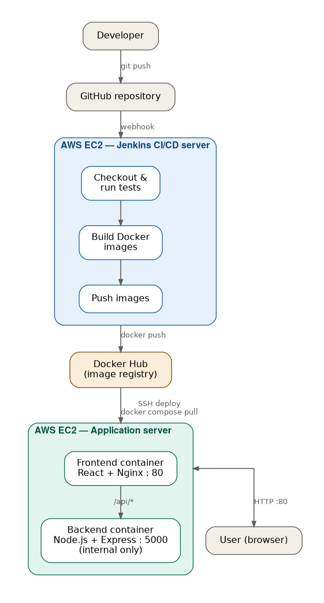

# End-to-End CI/CD Pipeline on AWS with Jenkins and Docker

An end-to-end CI/CD project demonstrating how a containerized full-stack application can be automatically tested, built, published, deployed, and verified using Jenkins, Docker, GitHub Webhooks, Docker Hub, and AWS EC2.

The project uses separate EC2 instances for the Jenkins CI/CD server and the application deployment server to demonstrate a multi-server deployment architecture.

---

## Architecture


---

## Project Overview

The goal of this project is to implement a practical CI/CD workflow where a developer only needs to push code to GitHub.

A GitHub webhook automatically triggers Jenkins, which runs the CI/CD pipeline and deploys the new application version to a separate AWS EC2 application server.

### Automated workflow

```

```

No manual deployment is required after the pipeline is triggered.

---

## Technologies Used

| Technology | Purpose |

| AWS EC2 | Hosts Jenkins and the application deployment server |
| Jenkins | CI/CD pipeline automation |
| Docker | Application containerization |
| Docker Compose | Multi-container application deployment |
| Docker Hub | Docker image registry |
| GitHub | Source code management |
| GitHub Webhooks | Automatically triggers Jenkins on code push |
| React | Frontend application |
| Vite | Frontend build tooling |
| Node.js | Backend runtime |
| Express.js | Backend API |
| Jest | Automated backend testing |
| Supertest | HTTP endpoint testing |
| Nginx | Serves React frontend and reverse proxies API requests |
| SSH | Secure Jenkins-to-application-server communication |
| Git | Version control |

---

## Repository Structure

```
devops-cicd-pipeline/
│
├── backend/
│   ├── Dockerfile
│   ├── .dockerignore
│   ├── package.json
│   ├── server.js
│   └── server.test.js
│
├── frontend/
│   ├── Dockerfile
│   ├── .dockerignore
│   ├── nginx.conf
│   ├── package.json
│   └── src/
│
├── docker-compose.yml
├── docker-compose.prod.yml
├── Jenkinsfile
├── .gitignore
└── README.md
```

---

## Application Architecture

The application consists of two services.

### Frontend

The frontend is built with React and Vite.

A multi-stage Docker build is used:

1. Node.js builds the React application.
2. The generated static files are copied into an Nginx image.
3. Nginx serves the frontend on port `80`.

Nginx also acts as a reverse proxy for backend API requests.

```
Browser
   |
   | HTTP :80
   v
Nginx
   |
   | /api/*
   v
Backend Container :5000
```

### Backend

The backend is a Node.js/Express API.

The application provides a health endpoint:

```
GET /health
```

Expected response:

```json
{
  "status": "healthy"
}
```

In the production Docker Compose configuration, the backend is not directly exposed to the internet.

It is accessible to the frontend container through the Docker network.

---

## Docker Networking

Docker Compose automatically creates an internal network for the application services.

The frontend can therefore communicate with the backend using its Compose service name:

```text
backend:5000
```

Nginx proxies:

```text
/api/health
```

to:

```text
http://backend:5000/health
```

This allows the backend container to remain internal while the frontend is exposed through port `80`.

---

## CI/CD Pipeline

The pipeline is defined as code using the root-level `Jenkinsfile`.

The pipeline contains the following stages.

### 1. Backend Test

Jenkins creates a temporary Node.js Docker environment and executes:

```bash
npm ci
npm test
```

Jest and Supertest verify the backend health endpoint before an application image can proceed through the pipeline.

If the tests fail, subsequent deployment stages do not execute.

---

### 2. Docker Build

Jenkins builds separate Docker images for the frontend and backend.

Each image is tagged using the Jenkins build number:

```text
devops-cicd-backend:<BUILD_NUMBER>
devops-cicd-frontend:<BUILD_NUMBER>
```

For example:

```text
devops-cicd-backend:17
devops-cicd-frontend:17
```

Using immutable build-specific tags makes it possible to identify exactly which pipeline build produced a deployed image.

---

### 3. Push Docker Images

After successful testing and image creation, Jenkins authenticates to Docker Hub using credentials stored in Jenkins Credentials.

The images are tagged and pushed as:

```text
<dockerhub-username>/devops-cicd-backend:<BUILD_NUMBER>
<dockerhub-username>/devops-cicd-frontend:<BUILD_NUMBER>
```

Docker Hub credentials are not stored in the Git repository or directly inside the Jenkinsfile.

---

### 4. Deploy to Application Server

Jenkins connects to the application EC2 instance over SSH.

The deployment server updates its deployment configuration and runs:

```bash
docker compose -f docker-compose.prod.yml pull
docker compose -f docker-compose.prod.yml up -d
```

The Jenkins build number is supplied as `IMAGE_TAG`.

For example:

```bash
IMAGE_TAG=17 docker compose -f docker-compose.prod.yml up -d
```

The production Compose configuration then deploys:

```text
backend:17
frontend:17
```

This ensures that the exact image version produced by the current Jenkins build is deployed.

---

### 5. Deployment Verification

After deployment, Jenkins waits briefly for the containers to initialize and performs an HTTP health check:

```bash
curl -f http://<APPLICATION_SERVER_PRIVATE_IP>/api/health
```

Expected response:

```json
{
  "status": "healthy"
}
```

The Jenkins pipeline is marked successful only when the deployed application responds successfully.

---

## Automatic GitHub Webhook Trigger

The GitHub repository is configured with a webhook pointing to the Jenkins GitHub webhook endpoint.

```text
GitHub Push
      |
      v
/github-webhook/
      |
      v
Jenkins
```

Jenkins uses:

```text
GitHub hook trigger for GITScm polling
```

As a result, pushing a commit to the `main` branch automatically starts the CI/CD pipeline.

The developer does not need to manually select **Build Now** in Jenkins.

---

## Deployment Architecture

Two AWS EC2 instances are used.

### Jenkins Server

Responsibilities:

- Run Jenkins
- Checkout source code
- Execute automated tests
- Build Docker images
- Authenticate with Docker Hub
- Push versioned images
- Initiate remote deployment
- Verify application health

### Application Server

Responsibilities:

- Run Docker Engine
- Run Docker Compose
- Pull application images from Docker Hub
- Run frontend and backend containers
- Expose the frontend through port `80`

Separating CI workloads from application workloads provides a clearer separation of responsibilities than running Jenkins and the application on the same host.

---

## Production Docker Compose

The production deployment uses registry images instead of building source code directly on the application server.

Example:

```yaml
services:
  backend:
    image: <dockerhub-username>/devops-cicd-backend:${IMAGE_TAG}
    restart: unless-stopped

  frontend:
    image: <dockerhub-username>/devops-cicd-frontend:${IMAGE_TAG}
    restart: unless-stopped
    ports:
      - "80:80"
    depends_on:
      - backend
```

This creates an important separation:

```text
Jenkins Server
      |
      | builds once
      v
Docker Registry
      |
      | deploys same artifact
      v
Application Server
```

The deployment server does not rebuild application images.

---

## Jenkins Credentials

Sensitive credentials are managed through Jenkins Credentials rather than committed to source control.

The project uses credentials for:

### Docker Hub

Used to authenticate before pushing Docker images.

### Application Server SSH

An SSH private key credential allows Jenkins to authenticate to the application EC2 server.

The private key itself is never stored in the Jenkinsfile or Git repository.

---

## AWS Security Groups

The architecture uses security groups to control network access.

Conceptually:

```text
Internet
   |
   | HTTP :80
   v
Application EC2

Jenkins EC2
   |
   | SSH :22
   v
Application EC2
```

The application server permits SSH access from the Jenkins server for automated deployment.

The backend application port `5000` is not required to be publicly exposed because communication occurs through the Docker network.

> Security group rules used during development/testing should be hardened before treating the environment as production-ready.

---

## Running Locally

Clone the repository:

```bash
git clone <repository-url>
cd devops-cicd-pipeline
```

Start the application using Docker Compose:

```bash
docker compose up -d --build
```

Check running containers:

```bash
docker compose ps
```

The frontend can then be accessed through the host port configured in `docker-compose.yml`.

Stop the application:

```bash
docker compose down
```

---

## Testing

Backend tests can be executed independently:

```bash
cd backend
npm ci
npm test
```

The test suite verifies that:

```text
GET /health
```

returns HTTP `200` and:

```json
{
  "status": "healthy"
}
```

---

## Deployment Flow Example

A normal deployment requires only a Git push:

```bash
git add .
git commit -m "feat: update application"
git push origin main
```

GitHub then sends the webhook automatically.

```text
Developer
   |
   | git push
   v
GitHub
   |
   | webhook
   v
Jenkins
   |
   +--> Test
   |
   +--> Build Docker Images
   |
   +--> Push to Docker Hub
   |
   +--> SSH Deployment
   |
   +--> Docker Compose
   |
   +--> Health Check
   |
   v
Application Updated
```

---

## Key DevOps Concepts Demonstrated

This project demonstrates practical experience with:

- CI/CD pipeline-as-code
- Automated pipeline triggering
- Git based development workflows
- Automated application testing
- Docker image creation
- Multi-stage Docker builds
- Container registries
- Immutable/versioned image tagging
- Docker networking
- Docker Compose deployments
- Nginx reverse proxying
- Jenkins credential management
- SSH-based remote deployments
- AWS EC2
- AWS security groups
- Multi-server architecture
- Post-deployment health verification

---

## Current Limitations and Future Improvements

This project is designed as a hands-on DevOps portfolio implementation and can be extended further.

Potential improvements include:

- HTTPS/TLS termination
- Domain name configuration
- Reverse proxy for Jenkins
- More restrictive Jenkins network exposure
- Dedicated Jenkins agents
- Automated rollback on failed health checks
- Docker image vulnerability scanning
- Frontend automated tests
- Persistent centralized logging
- Prometheus monitoring
- Grafana dashboards
- Infrastructure provisioning with Terraform
- Deployment to Kubernetes
- Secret management using AWS-native services
- Deployment without long-lived SSH credentials

---

## Lessons Learned

Building this project provided hands-on experience with the complete lifecycle of an application deployment rather than treating CI/CD as only a Jenkins configuration exercise.

Key areas included:

- troubleshooting Jenkins Docker permissions and agents
- managing CI credentials securely
- understanding Docker DNS and container networking
- separating build and deployment responsibilities
- using versioned container images
- configuring Nginx as an internal API reverse proxy
- connecting Jenkins securely to a remote deployment server
- automatically triggering pipelines through GitHub webhooks
- verifying deployments using application health endpoints

---

## Project Status

Current pipeline:

```text
Git Push
   ↓
GitHub Webhook
   ↓
Jenkins
   ↓
Automated Tests
   ↓
Docker Build
   ↓
Docker Hub Push
   ↓
Remote EC2 Deployment
   ↓
Docker Compose
   ↓
Health Verification
   ↓
SUCCESS
```

**Status: End-to-end CI/CD automation operational.**

---

## Author

**Ishini**

DevOps / Cloud Engineering Portfolio Project
